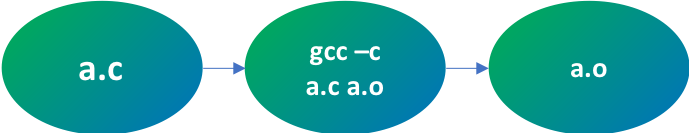
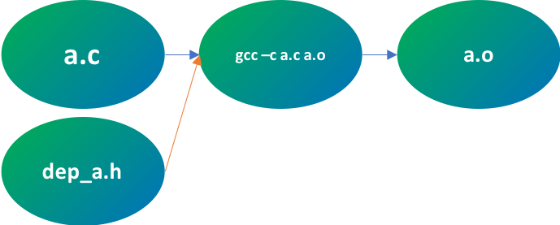
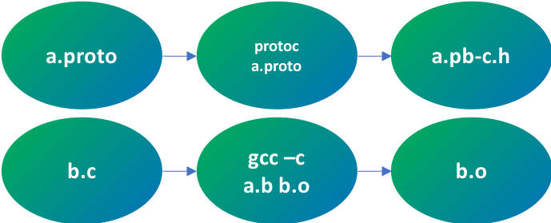
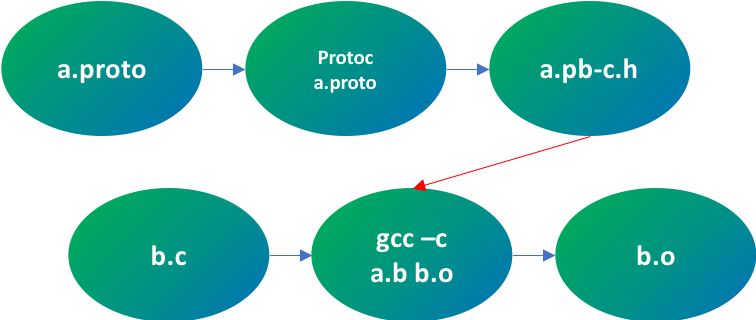

UMake Overview
==============
Since a lot of the core concepts from tup apply to umake it is highly recommended to read the following:

* http://gittup.org/tup/ex_dependencies.html
* http://gittup.org/tup/make_vs_tup.html


Why UMake
---------
- Fast modification detection (sub second event for large projects)
- More parallelism due to DAG (more details later)
- Fast re-compilation, with built-in cache (local-cache, remote-cache)


My First UMakfile
-----------------
`a.c`:
```
#include "dep_a.h"
#include "stdio.h"

int
main()
{
    printf("hello\n");
    return 0;
}
```
`UMakefile`:
```
: a.c > gcc -c {filename} {target} > a.o
```
the command parsed to the following `bash` command
```
gcc -c a.c a.o
```

### Graph after parsing



### Graph after running the cmd


Now if any of the nodes (`a.c`, `dep_a.h`, `gcc -c a.c a.o` or `a.o`) will be modified, `a.o` will be regenerated.

Targets as dependencies
----------------------
`b.c`:
```
#include "a.pb-c.h"
#include "stdio.h"

int
main()
{
    printf("hello\n");
    return 0;
}
```
Lets have another "compilation" command that generates headers that used by other command:

```
: a.proto > protoc {filename} > a.pb-c.h a.pb-c.c
: b.c > gcc -c {filename} {target} > b.o
```

### Graph after parsing



Now we have copmilation ordering issue. `b.o` might be compiled before `a.proto` because nothing enforce the ordering between `a.proto` and `b.o`

When running this `UMakefile` as is, an error will be generated. This is because command using other target (to generate `b.o` we accessing `a.pb-c.h` which is also generated)

### Manual Dependency: `|`
In order to fix this order issue we need to tell `umake` that generating `b.o` should come only after `a.pb-c.h`. We would use `| a.pb-c.h` for that.

`UMakefile`:
```
: a.proto > protoc {filename} > a.pb-c.h a.pb-c.c
: b.c | a.pb-c.h > gcc -c {filename} {target} > b.o
```

### Graph after parsing



:foreach
--------

```
: src/src_a.c > compile.sh {filename} {target} > src/src_a.o
: src/src_b.c > compile.sh {filename} {target} > src/src_b.o
: src/src_c.c > compile.sh {filename} {target} > src/src_c.o
: src/src_d.c > compile.sh {filename} {target} > src/src_d.o
```
can be changed to:
```
:foreach src/*.c > compile.sh {filename} {target} > {dir}/{noext}.umake.o
```
`:foreach` works exactlly like `:` (macros, vars, manual dependencies.)

Macros and Variables
--------------------
The above statement might repeated many times in UMakefile. so macros can be used in order to make life easier.

```
!c(includes, flags) : gcc -c {filename} {target} $includes $flags > {dir}/{noext}.umake.o

: src/*.c > !c(-Iinclude, -O3)
```

`c` - macro name

`includes`, `flags` - arguments to marcro


**The above can be also used with variables:**
```
!c(includes, flags) : compile.sh {filename} {target} $includes $flags > {dir}/{noext}.umake.o

$includes = -Iinclude
$flags = -O3
: src/*.c > !c($includes, $flags)
```

Compiling specific target
-------------------------
```
umake lib/libmy_lib.so
```
In this case only the subraph of `lib/libmy_lib.so` will be recompiled

Variants
--------
```
$debug_flags = -O3

[variant:debug]
$debug_flags = -O0

$includes = $debug_flags
: src/*.c > !c($debug_flags, )
```
Now if compiled with `umake` the `-O3` flags will be passed. If compiled with `umake -v debug` the `-O0` flags will be passed.
